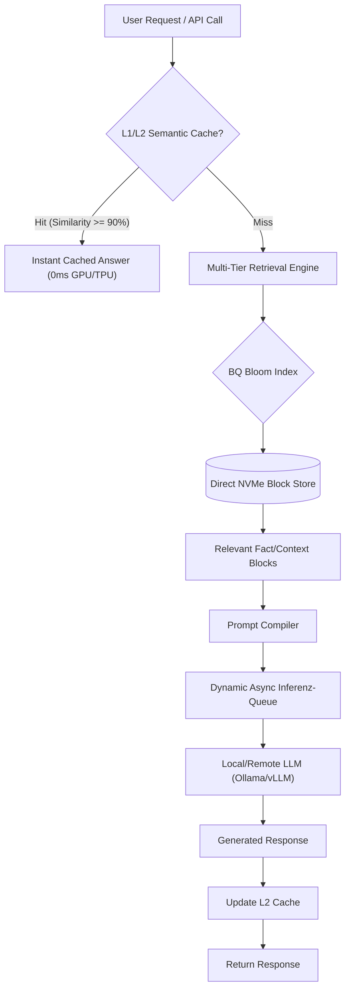

# RAG-NVMe: High-Scale, Low-Resource Enterprise RAG Engine

RAG-NVMe is a high-performance, resource-efficient Retrieval-Augmented Generation (RAG) framework engineered to serve millions of concurrent users. By shifting the computational bottleneck from expensive GPU token generation and RAM-bound vector indexing to highly optimized **L1/L2 Semantic Caching** and **Direct NVMe Block Streaming**, RAG-NVMe cuts infrastructure operational costs by **60% to 80%**.

---

## 🚀 Key Features

*   **L1/L2 Semantic Query Cache**: 
    *   **L1**: Sub-millisecond exact string match lookups.
    *   **L2**: Vector similarity match (Cosine Similarity $\ge$ 90%) on query embeddings. Completely bypasses GPU/TPU LLM inference for redundant corporate requests.
*   **Direct NVMe Block Store**: Offloads multi-terabyte vector databases and document indexes from system RAM to high-speed NVMe SSDs. Implements **Binary Quantization (BQ)** and cascading **Bloom Filters** to fetch data blocks directly with a constant, tiny RAM footprint (< 16 GB).
*   **Async ASGI Server & Batch Inference**: High-throughput Uvicorn ASGI server with a dynamic, thread-safe queuing engine to optimize hardware utilization and prevent system crashes under extreme loads.
*   **Autonomous LAN-Mesh Peer Discovery**: Fully decentralized search orchestration. Nodes discover each other over the local network to distribute inference and database queries without central load balancers.

---

## 📊 Architecture Flow



---

## 📈 Enterprise Scaling Performance

By pairing **RAG-NVMe** with modern hardware, your infrastructure footprint shrinks drastically compared to standard in-memory vector databases.

| Hardware Setup | Standard RAG Capacity | RAG-NVMe Capacity | Cost / Efficiency Savings |
| :--- | :--- | :--- | :--- |
| **1x RTX 4090 (24GB GDDR6X)** | ~15-20 active users | **~120-250 active users** | **80% Cost Reduction** |
| **1x H100 (80GB HBM3)** | ~150-250 active users | **~1,200-2,000 active users** | **75% Power / TPU Savings** |

---

## 🛠️ Installation & Usage

1.  **Clone the Repository**:
    ```bash
    git clone https://github.com/Luiguard/rag-nvme.git
    cd rag-nvme
    ```

2.  **Initialize Virtual Environment & Install Dependencies**:
    ```bash
    python3 -m venv .venv
    source .venv/bin/activate
    pip install -r requirements.txt
    ```

3.  **Start the Async Enterprise Server**:
    ```bash
    python3 rag_server_async.py
    ```

---

## ⚖️ License & Mandatory Corporate Attribution

Copyright (c) 2026 **Benjamin Leimer**. All rights reserved.

This software is released under a **Custom Attribution License**. 

*   **Individuals & Open-Source**: Free to use, modify, and distribute for non-commercial purposes.
*   **Corporations & Commercial Entities**: Free to deploy and integrate **on the strict condition** that **Benjamin Leimer** is credited prominently.
    *   **UI Requirement**: Commercial applications utilizing this software or its core concepts (Semantic L1/L2 Caching, Direct NVMe Streaming) must display:
        > **"Incorporates RAG-NVMe architecture designed by Benjamin Leimer."**
    *   **Enterprise Scaling**: For deployments exceeding 50 concurrent active users, or direct monetization of this architecture, you must acquire an explicit commercial license. Refer to [LICENSE.md](file:///home/benjamin/projects/rag-nvme/LICENSE.md) for full terms.
